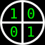

#  XORcat &nbsp;&nbsp;&nbsp;&nbsp;&nbsp;&nbsp;&nbsp;&nbsp;&nbsp;&nbsp;&nbsp;&nbsp;&nbsp;&nbsp;&nbsp;&nbsp;&nbsp;&nbsp;&nbsp;&nbsp;&nbsp;&nbsp;&nbsp;&nbsp;&nbsp;&nbsp;&nbsp;&nbsp;&nbsp;&nbsp;&nbsp;&nbsp;&nbsp;&nbsp;&nbsp;&nbsp;&nbsp;&nbsp;&nbsp;&nbsp;&nbsp;&nbsp;&nbsp;&nbsp;&nbsp;&nbsp; [](https://hits.seeyoufarm.com)

**XORcat is a tool for [bitwise-XOR](https://en.wikipedia.org/wiki/Bitwise_operation#XOR) files/streams.**

Files/streams of different sizes can also be XORed; in this case, the
remaining part of the longer file is copied as is (as if it were XORed with
0s), unless `_` is specified:
```shell
$ xorcat
Usage:
	xorcat input1 input2           #in this case, if input2 file name is `_` use ./_
	xorcat input1 input2 _         #stop at the shorter input file length
	xorcat input1                  #read input2 from stdin
	xorcat input1 _                #read input2 from stdin, stop at the shorter input file length
output is always written to stdout
```

### Some use cases

- [**OTP - one-time pad**](https://en.wikipedia.org/wiki/One-time_pad)  
	Let's say we have to encrypt the file `myfile`; so, first create a key
	with the same size of `myfile`:
	```shell
	xorkeygen myfile
	```
	this creates the key file `xorkey1`; now XOR `myfile` with `xorkey1`:
	```shell
	xorcat myfile xorkey1 >encfile
	```
	`encfile` is the encrypted file.
	
	To get back `myfile` from `xorkey1` and `encfile`:
	```shell
	xorcat encfile xorkey1 >myfile
	```

- [**Secret sharing**](https://en.wikipedia.org/wiki/Secret_sharing#Trivial_secret_sharing)  
	Let's say `myfile` is our secret file to distribute among a group, for
	example, of 4 people; so first create 3 key files (4 people - 1):
	```shell
	xorkeygen myfile 3
	```
	then, XOR `myfile` with all 3 keys:
	```shell
	xorcat myfile xorkey1 | xorcat xorkey2 | xorcat xorkey3 >xfile4
	```
	now, give each of the first 3 people a xorkey key file and `xfile4`
	to the 4^ person.
	
	Now, only if all 4 people XOR their files together, `myfile` can be
	retrieved:
	```shell
	xorcat xfile4 xorkey1 | xorcat xorkey2 | xorcat xorkey3 >myfile
	```
	Note that OTP can be considered a particular case of XOR secret sharing
	where the group consists of 2 people.

- [**Parity files and disks**](https://en.wikipedia.org/wiki/Parity_drive)
	- **Parity file**  
		Suppose we want to create a parity file for `file1`, `file2`, `file3`,
		`file4` and `file5`:
		```shell
		xorcat file1 file2 | xorcat file3 | xorcat file4 | xorcat file5 >parityfile
		```
		now, `parityfile` contains the parity among the 5 files we XORed, and it's
		size is equal to the biggest of the 5 files.
		
		Now, if anyone of these files gets lost or damaged, let's say `file2`,
		it can be retrieved by XORing all the other files with `parityfile`:
		```shell
		xorcat file1 file3 | xorcat file4 | xorcat file5 | xorcat parityfile >file2
		```
		then, if the original size of `file2` is smaller than the biggest-sized
		file, it's original size can be restored in this way, replacing `<size>`
		with the original size in Bytes of `file2`:
		```shell
		truncate -s <size> file2
		```
	- **Parity drive**  
		Same works with disks/drives, but needs `root` privileges;
		so first launch:
		```shell
		sudo -i
		```
		to get `root` privileges; then, let's say we want to put on `sdd` the
		parity among `sda`, `sdb` and `sdc` disks (in this example we also use
		`dd` to display the progress):
		```shell
		xorcat /dev/sda /dev/sdb | xorcat /dev/sdc | dd of=/dev/sdd bs=512k iflag=fullblock status=progress
		```
		**<ins>WARNING</ins>**: all previous `sdd` content will be irreversibly lost!
		
		You can also use a file instead of `sdd`, simply replace `/dev/sdd`
		with a file name/path.

## Build

- **Compiling**:
	```shell
	gcc -Ofast -s xorcat.c -o xorcat
	```
	or
	```shell
	clang -Ofast -s xorcat.c -o xorcat
	```
	on Windows, [MSYS2](https://www.msys2.org/) or [Cygwin](https://www.cygwin.com/) can be used
- **Installing**:
	```shell
	sudo cp xorcat xorkeygen /usr/local/bin/ && sudo chown root: /usr/local/bin/xor{cat,keygen}
	```
- **Uninstalling**:
	```shell
	sudo rm /usr/local/bin/xor{cat,keygen}
	```

## License


Copyright © 2022, 2023  [Samuel Albani](https://gitlab.com/viablu)

XORcat is free software: you can redistribute it and/or modify
it under the terms of the GNU Affero General Public License as published by
the Free Software Foundation, either version 3 of the License, or
(at your option) any later version.

XORcat is distributed in the hope that it will be useful,
but WITHOUT ANY WARRANTY; without even the implied warranty of
MERCHANTABILITY or FITNESS FOR A PARTICULAR PURPOSE.  See the
GNU Affero General Public License for more details.

You should have received a copy of the GNU Affero General Public License
along with XORcat.  If not, see <https://www.gnu.org/licenses/>.

## Similar projects

- [xcat](https://github.com/mstrand/xcat)
- [Monolith](http://monolith.sourceforge.net)
